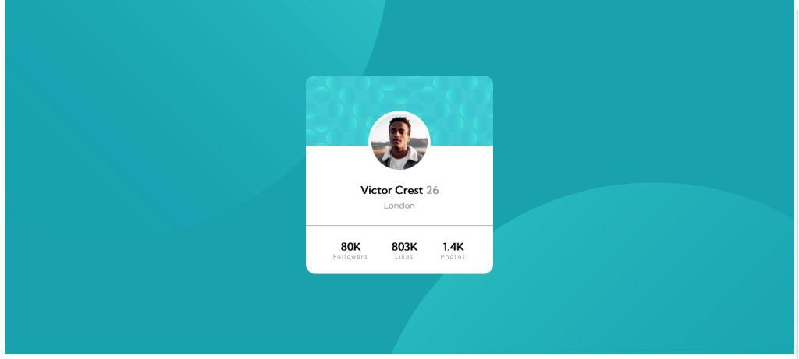
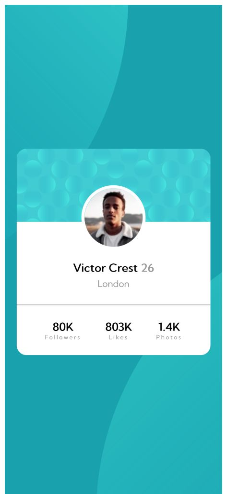

# Frontend Mentor - Profile card component solution

This is a solution to the [Profile card component challenge on Frontend Mentor](https://www.frontendmentor.io/challenges/profile-card-component-cfArpWshJ). Frontend Mentor challenges help you improve your coding skills by building realistic projects. 

## Table of contents

- [Overview](#overview)
  - [The challenge](#the-challenge)
  - [Screenshot](#screenshot)
  - [Links](#links)
- [My process](#my-process)
  - [Built with](#built-with)
  - [What I learned](#what-i-learned)
- [Author](#author)

## Overview

### The challenge

- Build out the project to the designs provided

### Screenshot



Desktop screenshot




Mobile screenshot

### Links

- Solution URL: [Frontend mentor solution](https://your-solution-url.com)
- Live Site URL: [Live site at Netlify](https://auriga-profile-card.netlify.app/)

## My process

### Built with

- Semantic HTML5 markup
- CSS custom properties
- Flexbox

### What I learned

I learn how to positioned multiple backround image for desktop and mobile with media query method.

To see how I did it, see  code snippet below:

```css
@media only screen and (max-width: 767px) {
    #wrapper {
        background-position: 125% -500px,
                              150px 350px;
    }
}
```

## Author

- Frontend Mentor - [@auriga2124](https://www.frontendmentor.io/profile/auriga2124)
- Twitter - [@ErkaRahman](https://twitter.com/ErkaRahman)
